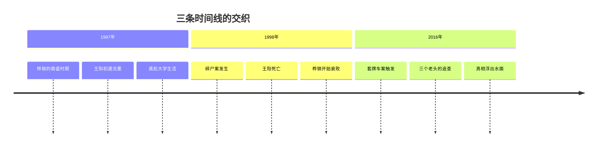

---
tags:
  - 漫长的季节
  - 国产剧
  - 豆瓣高分
  - 东北
  - 辛爽
  - 影视评论
  - 社会现实
category: 影视评论
categories:
  - 文化随笔
  - 影评
  - 社会观察
title: 《漫长的季节》凭什么9.4分？这不是悬疑剧，这是被时代碾过的一代人
date: 2026-08-20T11:02:00
banner: /images/东北1-1.webp
description: 一篇关于《漫长的季节》的深度影评——从叙事结构到人物塑造，从东北语境到命运主题，拆解这部近八年国产剧最高分背后的真正力量。
ai: true
pub-blog: true
status: published
---
# 《漫长的季节》凭什么9.4分？

豆瓣开分 9.0，收官冲到 9.5，最终稳定在 9.4。超过 108 万人打分——**这是近八年来国产剧的最高分。**

如果你只把它当成一部“高分悬疑剧”，那可就太小看它了。

《漫长的季节》当然有一个悬疑的外壳：一桩 18 年前的碎尸案，一个死因成谜的少年，三个被往事困住的老头。但真正让它封神的，从来不是“谁是凶手”的谜底，而是**时间如何在人身上碾过去，留下了怎样的痕迹。**

导演辛爽说得特别直白：“我们想用时间的方法去讲时间，**讲时间是怎么从一群人身上穿过，在他们身上留下了怎样的痕迹**，最后时间又是怎样抹平了这些痕迹。”

悬疑是外套，**命运才是底裤。**

## 三条时间线，像麻花一样拧在一起

故事从 2016 年讲起。出租车司机龚彪低价买来的二手车被人套了牌，卷入了一起交通事故。他和姐夫王响顺着线索追查，**18 年前一桩碎尸悬案浮出水面**。而王响的儿子王阳，当年就死在这桩案子里。

一桩旧案，三个老头，一段被雪埋了 18 年的真相。

辛爽把三条时间线——**1997 年、1998 年、2016 年**——像拧麻花一样编在一起。这不是炫技，而是为了让观众直接感受“时间的重量”。

1997 年，王响是意气风发的桦钢火车司机，劳模奖章挂满胸前，说话办事带着工人阶级的骄傲。龚彪是刚分到厂办的大学生，穿着白衬衫，满脑子理想主义。马德胜是英姿飒爽的刑警队长，破案如神，眼里有光。

2016 年，王响成了开出租的白发老人，背驼了，话少了，眼神里全是疲惫。龚彪大腹便便，一事无成，成了油腻中年男人的代名词。马德胜在老年舞团里找存在感，曾经的刑警队长，如今最骄傲的事是跳拉丁舞拿了社区奖。

**18 年，能把人变成什么样？**

这部剧用 12 集的篇幅，给了你一个极其残忍的答案。

## 辛爽的野心：悬疑是壳，命运才是核

《隐秘的角落》之后，辛爽这个名字和“高水准悬疑”绑在了一起。但如果你以为他要重复自己，那就错了。

《漫长的季节》前几集的节奏慢得不像悬疑剧——大量的笔墨都在写人，写时代，写生活里的一地鸡毛。

王响下夜班拎着一兜子油条回家，跟老婆唠唠叨叨的日常；龚彪挺着啤酒肚跟人吹牛扯淡，吹完被现实打脸；马德胜沉迷拉丁舞不能自拔，跳舞比破案还投入。

**这些跟破案有什么关系？**

没什么直接关系。

但这就是人生。

辛爽要拍的从来不是“谁杀了谁”，而是“时代如何杀死了人的一部分”。悬疑只是钩子，钩住你之后，他要给你看的是：**一群人在历史的大潮里怎么挣扎、怎么沉没、又怎么从水里爬出来。**

## 三个人物，三种困局

### 王响：困在“父亲”身份里的旧时代工人

范伟演的王响，是全剧的灵魂。

18 年前，他是桦钢的火车司机，是厂里的劳动模范，是典型的“共和国长子”式的工人——以厂为家，以岗为荣。他这辈子最大的骄傲，就是开火车。最大的愿望，是儿子王阳能进厂接班，过上和他一样的“体面生活”。

但时代变了。

桦钢垮了，“接班”成了一个笑话。更残忍的是，王阳死了。死因不明，警方定性为“溺水自杀”，但王响不信。他这辈子最后的执念就是：**我要知道我儿子是怎么死的。**

18 年。他活在“等待真相”里，活在“如果那天我没有……”的假设里，活在“我不配当一个好父亲”的愧疚里。

最后一集，真相终于大白。王响穿过一片金黄的玉米地，恍惚间看到年轻时开火车的自己。他拼命追着跑，对着那个意气风发的自己喊：**“往前看，别回头。”**

那一刻，无数人泪崩。

这 18 年的困局，在这一声喊里，终于解了。

### 龚彪：在理想与油腻之间被磨平的那个人

秦昊演的龚彪，是全剧最让人心酸的角色。

1997 年，他是厂办的大学生，是那个年代少有的文化人。他想做点“正经事”，想改变世界，至少想改变桦钢。但现实给了他狠狠一巴掌。

下岗、离婚、一事无成。18 年后，他成了一个挺着大肚子开出租的胖子，整天吹牛扯淡，从没人把他的理想当回事。

但他真的“失败”了吗？

最后一集，龚彪中了彩票头奖——然后出了车祸，死了。有人说这是荒诞，有人说这是宿命。但我更愿意相信：**这是辛爽给龚彪的最后一份温柔。** 在所有人都不相信他的时候，命运给了他一个“证明”——他不是废物，他只是生错了时代。

### 马德胜：在体制与自我之间摇摆的孤独者

马德胜是全剧最“体面”的人。

18 年前，他是刑警队长，破案如神，受人敬重。18 年后，他在老年舞团里跳拉丁，和一群老太太抢舞伴。

他嘴上说“早就放下了”，可当王响和龚彪找上门的时候，他第一个冲了上去。他跳拉丁舞时候的投入，和他当年破案时候的专注，一模一样。

**他这辈子最骄傲的事，从来不是破过多少案子，而是“我还是那个我”。**

## 东北语境：一片土地的集体创伤

《漫长的季节》不只是一部“悬疑剧”，它更是一部**东北叙事的集大成者**。

从文学上的双雪涛、班宇、郑执，到影视上的《钢的琴》《八月》《东北虎》，再到这部剧——一个完整的“东北文艺复兴”拼图正在形成。

这部剧的底色，是东北 90 年代国企改革的集体创伤。桦钢是虚构的，但桦钢的故事是真实的。成千上万个“桦钢”在当年倒下，数以千万计的“王响”和“龚彪”失去了他们赖以生存的“体面”。

下岗、失落、身份崩塌、尊严粉碎——这些东西被悬疑剧的外壳包裹着，却从未失去它的重量。

王响最后喊出的那句“往前看，别回头”，不只是对王阳说的，不只是对过去的自己说的，**更是对整个东北说的。**

别回头。别再困在“共和国长子”的荣耀里，别再困在“铁饭碗”的梦里，别再困在那 18 年的执念里。

## 再回首：一首歌，一部剧，一个时代

《再回首》响起的时候，弹幕里全是“泪崩了”。

这首歌选择得太精准了。它是一首“回头”的歌，唱的是“再回首，云遮断归途”，但剧里要表达的是“不回头”。

王响追着火车跑的时候，追的是过去，但喊的是未来。

**“漫长的季节”不是秋天，是王响被困住的那 18 年。**

而对于屏幕前的我们，这部剧之所以让人如此共情，是因为——**谁没有过一段“漫长的季节”呢？**

失去的亲人，错过的人，做错的选择，回不去的时光……每个人都有一段“被困住”的日子。

而这部剧想说的，也不过是那一句话：

**别回头，往前看。**

## 为什么是 9.4 分？

因为《漫长的季节》不只是“好看”，它是**有骨头**的。

它有悬疑的骨头，有生活的骨头，有时代的骨头，有尊严的骨头。它不像某些国产剧那样悬浮、虚假、用力过猛，它用最朴素的方式——好好写人、好好讲故事、好好尊重观众——拿到了它应得的一切。

辛爽在采访里说了一句特别好的话：

> “我们想做的不是让观众猜谁是凶手，而是让观众理解这些人的命运。”

这就够了。

《漫长的季节》之后，国产悬疑剧还有很长的路要走。但它立下了一个标杆——**悬疑可以不只是“谁杀了谁”，还可以是“时代杀了谁”。**

## 写在最后

《再回首》响起的那一刻，我忽然理解了这部剧真正的力量。

它不是让你哭，而是让你在哭完之后，还能站起来。

就像剧里的王响，18 年，他没有放弃。就像剧外的东北，经历了那么多，还在往前走。

**别回头，往前看。**

——这可能是我能想到的，对这部剧最简短、也最准确的评价。
